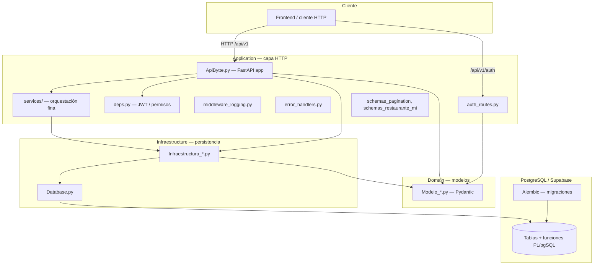
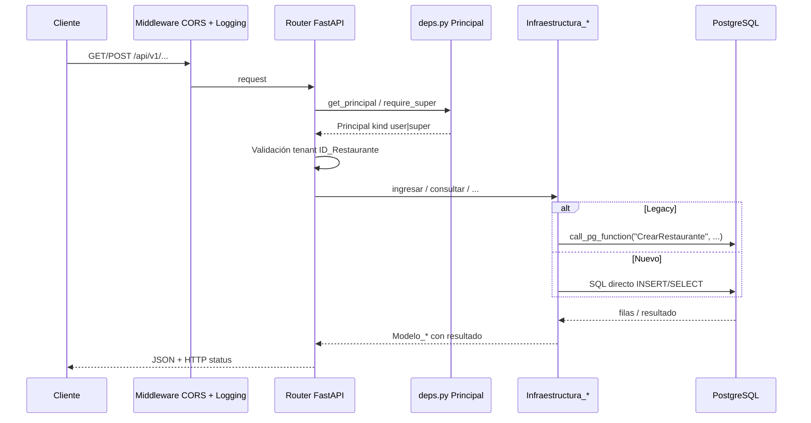
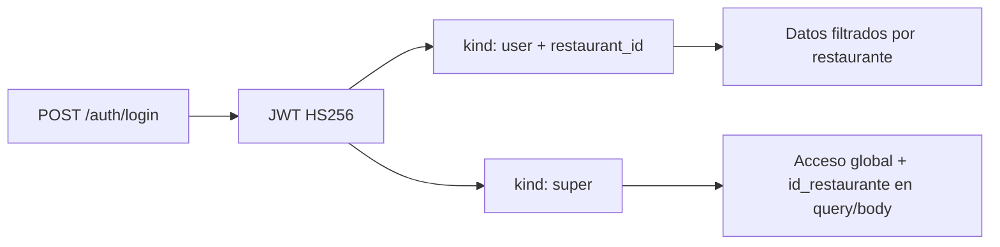
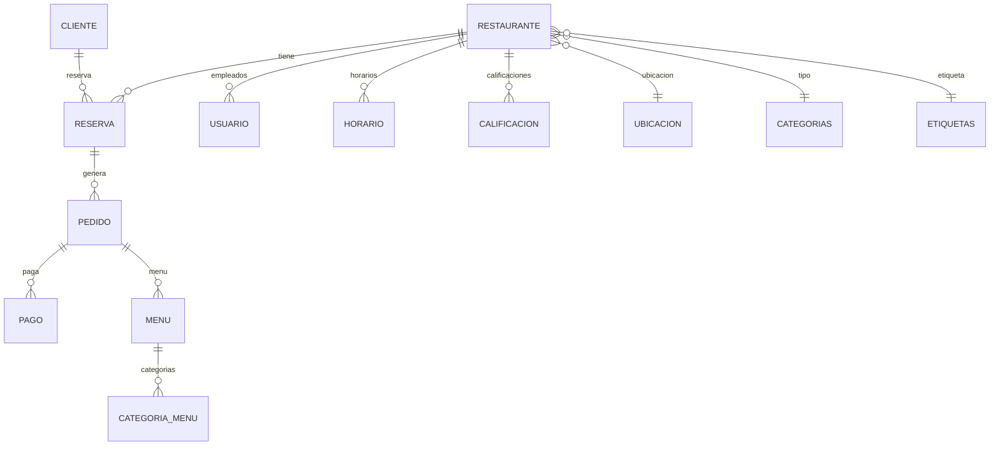
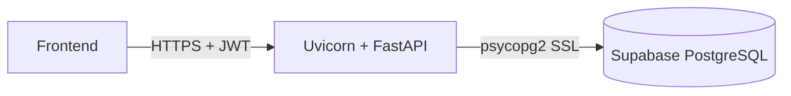

# Arquitectura del backend Bytte

Backend **FastAPI** para un ERP de restaurantes. Organizado en **capas** con nomenclatura en español. En runtime no usa ORM: se conecta a **PostgreSQL** (típicamente **Supabase**) mediante **psycopg2**.

Documentos relacionados:

- [`FRONTEND_API.md`](FRONTEND_API.md) — referencia de endpoints para el front
- [`FRONTEND_AUTH.md`](FRONTEND_AUTH.md) — JWT, CORS y permisos
- [`README.md`](../README.md) — instalación y uso

---

## Vista general



---

## Estructura de carpetas

```
bytte-backend/
├── Application/              # API, auth, middleware, utilidades HTTP
│   ├── ApiBytte.py           # App principal + endpoints REST bajo /api/v1
│   ├── auth_routes.py        # login + registro público
│   ├── deps.py               # Principal, require_super, require_tenant
│   ├── jwt_tokens.py         # Crear/decodificar JWT
│   ├── auth_config.py        # JWT_SECRET, expiración, algoritmo
│   ├── passwords.py          # verify_password / hash (bcrypt)
│   ├── error_handlers.py     # Errores HTTP/BD centralizados
│   ├── middleware_logging.py # Request id + logging JSON
│   ├── rate_limit.py         # SlowAPI
│   ├── http_util.py          # return_or_raise_legacy (patrón resultado)
│   ├── services/             # Casos de uso agregados
│   │   └── restaurante_mi.py
│   └── schemas_*.py          # DTOs de respuesta (paginación, agregados)
│
├── Domain/                   # Entidades / contratos de datos (Pydantic)
│   └── Modelo*.py            # Modelo_Restaurante, Modelo_Reserva, etc.
│
├── Infraestructure/          # Acceso a datos (nombre histórico con typo)
│   ├── Database.py           # Conexión, call_pg_function, ping_db
│   ├── Infraestructura_*.py  # Un módulo por agregado de negocio
│   ├── errors.py             # DomainError, NotFoundError, ConflictError…
│   └── exceptions.py         # ConfigurationError
│
├── alembic/                  # Migraciones de esquema
├── scripts/                  # SQL seed y migraciones manuales
├── tests/                    # pytest + TestClient
├── docs/                     # Guías de integración
└── main.py                   # Entry point alternativo (uvicorn)
```

---

## Flujo de una petición



1. **Middleware:** CORS (`FRONT_URL`) y logging estructurado con cabecera `X-Request-ID`.
2. **Autenticación:** casi todo exige `Authorization: Bearer` (salvo rutas públicas de auth y `GET /health`).
3. **Autorización:** dependencias `require_super`, `require_tenant` y filtrado por `restaurant_id` del JWT para empleados.
4. **Persistencia:** cada `Infraestructura_*` abre conexión, ejecuta operación y mapea filas → `Modelo_*`.
5. **Respuesta:** JSON serializado desde modelos Pydantic.

---

## Capas en detalle

### Application (presentación)

| Componente | Responsabilidad |
|------------|-----------------|
| `ApiBytte.py` | App FastAPI, router `/api/v1`, reglas de tenant, paginación, tags OpenAPI |
| `auth_routes.py` | Login JWT y registro público de restaurante (+ empleado opcional) |
| `deps.py` | Objeto `Principal` (`kind`, `user_id`, `email`, `restaurant_id`) |
| `services/restaurante_mi.py` | Orquesta varios repos en un solo agregado para el panel empleado |
| `error_handlers.py` | Traduce excepciones a `{ "detail", "error_type" }` |
| `rate_limit.py` | Límites SlowAPI en login (30/min) y registro (15/min) |

La lógica de negocio **no vive en una capa “Domain Service” separada**: se reparte entre las rutas (permisos, tenant, validación HTTP) y las clases de infraestructura (SQL y funciones PL/pgSQL).

### Domain (modelos)

- Clases Pydantic `Modelo_*`: contrato de entrada/salida de la API.
- No hay interfaces de repositorio ni entidades ricas con comportamiento.
- Campo legacy **`resultado: string`** en muchos modelos (`"Exitoso"` / `"… Fallido:…"`).

### Infraestructure (persistencia)

Dos patrones coexisten en el mismo proyecto:

| Patrón | Módulos típicos | Mecanismo |
|--------|-----------------|-----------|
| **Legacy** | Restaurante, Reserva, Cliente, Usuario, Pedido, Pagos, Rol, Ubicación, Categorías, Etiquetas, SuperUsuario | Funciones PostgreSQL vía `call_pg_function("CrearRestaurante", args)` |
| **Nuevo** | Horarios, calificaciones, menú, geografía, rango precio | SQL directo con `cursor.execute(...)` |

`Database.py` centraliza:

- Conexión por variables `DB_*` (prioridad) o `DATABASE_URL`
- `call_pg_function`: identificadores entre comillas para funciones como `"CrearRestaurante"` (PostgreSQL distingue mayúsculas)
- `ping_db()` usado por `GET /health`

Cada operación abre y cierra su propia conexión (sin pool de conexiones explícito).

---

## Seguridad y multi-tenant



| Rol JWT | Comportamiento |
|---------|----------------|
| **`user`** | Empleado de restaurante. El backend fuerza `ID_Restaurante` del token en altas/modificaciones y valida pertenencia en lecturas/bajas. |
| **`super`** | Administrador de plataforma. CRUD global; en recursos scoped por restaurante debe enviar `id_restaurante` (query) o `ID_Restaurante` (body). |

Payload JWT relevante: `sub` (id usuario), `email`, `kind`, `restaurant_id`.

Rutas públicas (sin token):

- `GET /health`
- `POST /api/v1/auth/login`
- `POST /api/v1/auth/registro/restaurante`

---

## Base de datos y migraciones

| Herramienta | Uso en el proyecto |
|-------------|-------------------|
| **psycopg2** | Runtime: conexiones ad-hoc por operación |
| **Alembic** | Migraciones versionadas (`baseline001`, `tr_sync_01`, …) |
| **SQLAlchemy** | Solo en Alembic para construir la URL de conexión (no hay modelos ORM en la app) |
| **scripts/*.sql** | Seed de demo y scripts SQL manuales (geografía, horarios, menú) |

Triggers en PostgreSQL (revisión `tr_sync_01`) mantienen coherentes:

- `restaurante.calificacion` ← promedio de `calificacion`
- `restaurante.rango_precios` ← filas de `rango_precio_restaurante`

---

## API y convenciones

| Aspecto | Valor |
|---------|--------|
| Prefijo REST | `/api/v1` |
| Auth | `/api/v1/auth` |
| Health | `GET /health` (raíz, sin prefijo) |
| Documentación OpenAPI | `{baseUrl}/docs` |
| Nombres legacy | PascalCase español (`ConsultarRestaurante`, `IngresarReserva`) |
| Rutas nuevas | kebab-case o RESTful (`/restaurantes/mi`, `/Reserva/{id}/estado`) |
| IDs en PUT/DELETE legacy | Query `?ID_Key=` + body JSON completo |
| IDs en rutas nuevas | Path param `{ID_Key}` |
| Paginación | `{ items, total, limit, offset }` — máx. `limit` 100 |

---

## Cross-cutting (transversal)

| Concern | Implementación |
|---------|----------------|
| CORS | `CORSMiddleware` → origen `FRONT_URL` |
| Logging | JSON por request: `method`, `path`, `status_code`, `duration_ms`, `principal_kind` |
| Errores HTTP | `HTTPException` → `{ detail, error_type: "http" }` |
| Validación Pydantic | 400 → `{ detail: [...], error_type: "validation" }` |
| Errores PostgreSQL | Handlers para `IntegrityError` (409), `OperationalError` (503), etc. |
| Patrón legacy | Campo `resultado` con `"Fallido"`; rutas nuevas usan `return_or_raise_legacy()` para elevar a HTTP 400 |
| Rate limiting | SlowAPI en endpoints de auth |

---

## Flujo de dominio principal

Relación típica entre entidades de negocio:



Validación tenant en cadena menú: `menu → pedido → reserva → id_restaurante`.

---

## Tests

```
tests/
├── conftest.py         # TestClient + skip si no hay BD
├── test_auth.py
├── test_health.py
├── test_tenant.py
└── test_validation.py
```

| Tipo | Comando | Requisito |
|------|---------|-----------|
| Unitarios (sin BD) | `pytest -m "not integration"` | Ninguno |
| Integración | `pytest` | `DATABASE_URL` o `DB_*` + PostgreSQL alcanzable |

---

## Despliegue típico



Variables de entorno críticas: `DATABASE_URL` o `DB_*`, `JWT_SECRET`, `FRONT_URL`.

Arranque en desarrollo:

```bash
uvicorn Application.ApiBytte:app --reload
```

---

## Fortalezas

- Separación clara **Application / Domain / Infraestructure**
- Multi-tenant por JWT aplicado en capa HTTP
- OpenAPI en `/docs` + guías en `docs/`
- Evolución gradual: SQL directo en módulos nuevos sin romper funciones PL/pgSQL legacy
- Servicios agregados (`restaurante_mi`) reducen round-trips al front

---

## Deuda técnica y limitaciones

| Tema | Descripción |
|------|-------------|
| Sin capa de servicios de dominio | Lógica repartida entre rutas e infraestructura |
| Patrón `resultado` | Mezcla errores de negocio en JSON 200 con códigos HTTP modernos |
| Conexiones | Una conexión por operación; sin pool |
| Nomenclatura | Carpeta `Infraestructure` (typo histórico) |
| Estilos de rutas | Conviven query `ID_Key` y path `{ID_Key}` |
| Clientes | Sin aislamiento por tenant en la API de clientes |

---

## Entry points

| Archivo | Uso |
|---------|-----|
| `uvicorn Application.ApiBytte:app --reload` | Comando principal (puerto 8000 por defecto) |
| `main.py` | Wrapper alternativo (puerto 8030, host 127.0.0.1) |
| `Application/ApiBytte.py` (`if __name__`) | Arranque directo con `PORT` env |

---

## Índice de módulos de infraestructura

| Módulo | Agregado |
|--------|----------|
| `Infraestructura_Restaurante` | Restaurantes |
| `Infraestructura_Reserva` | Reservas |
| `Infraestructura_Cliente` | Clientes |
| `Infraestructura_Usuario` | Empleados |
| `Infraestructura_Pedido` | Pedidos |
| `Infraestructura_Pagos` | Pagos |
| `Infraestructura_Rol` | Roles |
| `Infraestructura_Ubicacion` | Ubicaciones |
| `Infraestructura_Categorias` | Categorías globales |
| `Infraestructura_Etiquetas` | Etiquetas |
| `Infraestructura_SuperUsuario` | Superusuarios |
| `Infraestructura_Geografia` | Departamentos y ciudades |
| `Infraestructura_Horarios` | Horarios por restaurante |
| `Infraestructura_RangoPrecioRestaurante` | Rangos de precio |
| `Infraestructura_Calificacion` | Calificaciones |
| `Infraestructura_Menu` | Menú y categorías de menú por pedido |
