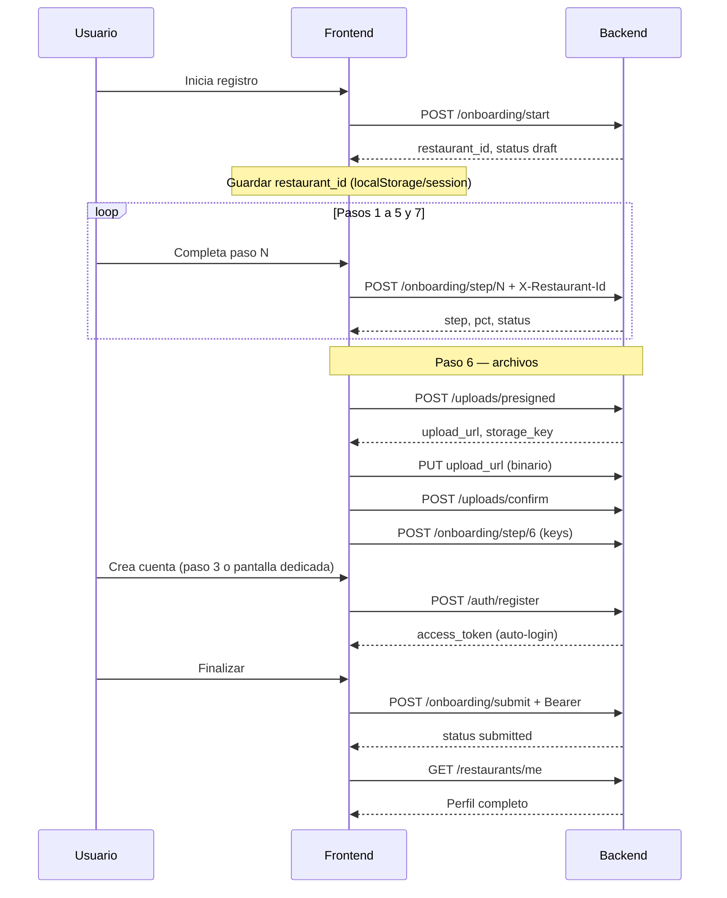

# Módulo de restaurante — guía frontend

Documento **independiente** para implementar en el cliente web el flujo de **alta de restaurante** (wizard de onboarding), subida de archivos, registro del dueño y panel post-alta.

Complementa la referencia general en [`FRONTEND_API.md`](FRONTEND_API.md) y la auth en [`FRONTEND_AUTH.md`](FRONTEND_AUTH.md).

---

## Qué construye este módulo

| Pantalla / feature | Backend |
|------------------|---------|
| Wizard 7 pasos (crear restaurante) | `/api/v1/onboarding/*` |
| Subida logo, portadas, documentos | `/api/v1/uploads/*` |
| Crear cuenta del dueño | `POST /api/v1/auth/register` |
| Activar restaurante | `POST /api/v1/onboarding/submit` |
| Panel / editar perfil | `GET/PATCH /api/v1/restaurants/me` |

**No uses** `POST /api/v1/auth/registro/restaurante` para el flujo Tabi; ese endpoint es legacy (crea restaurante + empleado en una sola llamada).

---

## Configuración base

| Concepto | Valor |
|----------|--------|
| Base URL (dev) | `http://localhost:8000` |
| Prefijo | `/api/v1` |
| Content-Type | `application/json` |
| CORS | El `Origin` del front debe coincidir con `FRONT_URL` del backend |

### Headers según fase

| Fase | Headers |
|------|---------|
| Pasos 1–7 **antes del login** | `X-Restaurant-Id: <id>` |
| Tras `register` o `login` | `Authorization: Bearer <token>` |
| Ambos presentes | Deben coincidir; si no → **403** |

---

## Flujo completo (orden obligatorio)



### Resumen en pasos

1. **`POST /onboarding/start`** → obtener `restaurant_id`
2. Guardar `restaurant_id` y enviarlo como **`X-Restaurant-Id`** en cada paso
3. **`POST /onboarding/step/{1-7}`** por cada pantalla del wizard
4. En el **paso 6**: subir archivos (presigned → PUT → confirm) y luego guardar keys en step/6
5. **`POST /auth/register`** → JWT del dueño
6. **`POST /onboarding/submit`** → activar restaurante
7. Redirigir al panel con **`GET /restaurants/me`**

---

## Estado en el frontend (recomendado)

```typescript
type OnboardingState = {
  restaurantId: string | null;   // de /onboarding/start
  currentStep: number;         // 1–7, también viene de /onboarding/status
  pct: number;
  status: "draft" | "submitted";
  accessToken: string | null;  // tras /auth/register o /auth/login
};

// Persistencia mínima antes del login
localStorage.setItem("onboarding_restaurant_id", restaurantId);
```

Recuperar progreso al recargar:

```http
GET /api/v1/onboarding/status
X-Restaurant-Id: 123
```

---

## Paso 0 — Iniciar

### `POST /api/v1/onboarding/start`

**Auth:** ninguna (público, rate limit 15/min)

**Respuesta 200:**

```json
{
  "restaurant_id": "123",
  "status": "draft"
}
```

**Acción frontend:** guardar `restaurant_id` y usarlo en todas las peticiones siguientes hasta tener JWT.

---

## Pasos 1–7 — Wizard

### Endpoint común

```http
POST /api/v1/onboarding/step/{step}
X-Restaurant-Id: 123
Content-Type: application/json
```

También acepta **`PATCH`** con la misma lógica (útil para autosave parcial).

**Respuesta 200:**

```json
{
  "restaurant_id": "123",
  "step": 3,
  "status": "draft",
  "pct": 43
}
```

`pct` ≈ `(step / 7) * 100`. Tras submit será `100`.

---

### Paso 1 — Información básica

```json
{
  "restaurant_name": "La Trattoria",
  "legal_name": "La Trattoria SAS",
  "description": "Cocina italiana en el centro",
  "website": "https://latrattoria.co",
  "social_links": {
    "instagram": "https://instagram.com/latrattoria",
    "facebook": ""
  },
  "restaurant_type": "Italiana"
}
```

| Campo | Requerido | Notas |
|-------|-----------|-------|
| `restaurant_name` | Sí | min 1 carácter |
| `legal_name` | No | Razón social |
| `description` | No | |
| `website` | No | URL |
| `social_links` | No | Objeto libre clave → URL |
| `restaurant_type` | No | Crea/enlaza categoría en BD |

---

### Paso 2 — Ubicación

```json
{
  "country": "Colombia",
  "department": "Cundinamarca",
  "city": "Bogotá",
  "address": "Calle 85 #12-34",
  "google_maps": "https://maps.google.com/?q=4.67,-74.05",
  "lat": 4.67,
  "lng": -74.05
}
```

Si envías `lat` + `lng` sin `google_maps`, el backend genera el enlace automáticamente.

---

### Paso 3 — Contacto del dueño

```json
{
  "owner_name": "Ana García",
  "email": "ana@latrattoria.co",
  "phone": "+573001234567"
}
```

Estos datos se guardan en el JSONB del onboarding. La **cuenta de usuario** se crea en el paso **`/auth/register`** (puede ser la misma pantalla o la siguiente).

---

### Paso 4 — Operaciones

```json
{
  "opening_hours": "08:00:00",
  "closing_hours": "22:00:00",
  "seating_capacity": 50,
  "number_tables": 12
}
```

Horarios en formato **`HH:MM:SS`**. El backend aplica el mismo horario a los 7 días de la semana.

---

### Paso 5 — Características

```json
{
  "reservation_types": ["online", "phone", "walk_in"],
  "cuisine_types": ["Italiana", "Mediterránea"],
  "services_offered": ["WiFi", "Terraza", "Parqueadero"]
}
```

Arrays de strings libres; el backend persiste en tablas M2M y JSONB.

---

### Paso 6 — Archivos (referencias)

Primero sube los archivos (sección [Uploads](#uploads-paso-6)). Luego guarda las keys:

```json
{
  "logo_key": "123/logo/a1b2_logo.png",
  "cover_image_keys": [
    "123/cover/c3d4_fachada.jpg",
    "123/cover/e5f6_interior.jpg"
  ],
  "document_keys": [
    "123/business_doc/g7h8_rut.pdf"
  ]
}
```

Las URLs públicas reales las persiste el backend en **`/uploads/confirm`**. Este paso solo registra las referencias en el JSONB.

---

### Paso 7 — Plan

```json
{
  "plan": "pro",
  "billing_cycle": "monthly"
}
```

| Campo | Valores |
|-------|---------|
| `plan` | `starter` \| `pro` \| `elite` |
| `billing_cycle` | `monthly` \| `annual` |

---

## Uploads (paso 6)

### 1. Pedir URL firmada

```http
POST /api/v1/uploads/presigned
X-Restaurant-Id: 123
Content-Type: application/json
```

```json
{
  "document_type": "logo",
  "filename": "logo.png",
  "mime_type": "image/png"
}
```

| `document_type` | Uso |
|-----------------|-----|
| `logo` | Logo principal → `restaurante.imagen_destacada` |
| `cover` | Imagen de portada → tabla `restaurante_imagen` |
| `business_doc` | Documento legal → tabla `documento_restaurante` |

**Respuesta:**

```json
{
  "storage_key": "123/logo/uuid_logo.png",
  "upload_url": "https://xxx.supabase.co/storage/v1/...",
  "expires_in": 3600
}
```

### 2. Subir binario a Supabase

```http
PUT {upload_url}
Content-Type: image/png
x-upsert: true

<bytes del archivo>
```

`upload_url` incluye `?token=...` (devuelto por `/uploads/presigned`).  
Hacerlo **desde el navegador** directamente a esa URL (no pasa por tu backend).

> Si el PUT falla o no se ejecuta, **`/uploads/confirm` devolverá 400** (el archivo no existe en Storage).

### 3. Confirmar en backend

```http
POST /api/v1/uploads/confirm
X-Restaurant-Id: 123
```

```json
{
  "document_type": "logo",
  "storage_key": "123/logo/uuid_logo.png",
  "filename": "logo.png",
  "mime_type": "image/png",
  "size_bytes": 204800
}
```

**Respuesta:**

```json
{
  "storage_key": "123/logo/uuid_logo.png",
  "public_url": "https://xxx.supabase.co/storage/v1/object/public/restaurant-documents/123/logo/uuid_logo.png",
  "document_type": "logo"
}
```

Repite para cada archivo. Al final, envía **`POST /onboarding/step/6`** con todas las `*_key`.

> **503** si el backend no tiene configurado Supabase Storage (`SUPABASE_URL`, etc.).

---

## Registro del dueño

### `POST /api/v1/auth/register`

**Auth:** ninguna (público, 15/min)

```json
{
  "email": "ana@latrattoria.co",
  "password": "MiClaveSegura123",
  "owner_name": "Ana García",
  "phone": "+573001234567",
  "restaurant_id": "123"
}
```

Alternativa: omitir `restaurant_id` en el body y enviar **`X-Restaurant-Id: 123`**.

**Respuesta 200 (auto-login):**

```json
{
  "access_token": "<jwt>",
  "token_type": "bearer",
  "kind": "user",
  "restaurant_id": "123"
}
```

| Error | Cuándo |
|-------|--------|
| **400** | Restaurante no existe o no está en `draft` |
| **409** | Correo ya registrado |

**Acción frontend:** guardar `access_token` y dejar de depender solo de `X-Restaurant-Id` (aunque puedes seguir enviándolo; debe coincidir con el token).

---

## Activar restaurante

### `POST /api/v1/onboarding/submit`

**Auth:** `Authorization: Bearer <token>` (usuario con `restaurant_id`)

**Respuesta 200:**

```json
{
  "restaurant_id": "123",
  "step": 7,
  "status": "submitted",
  "pct": 100,
  "submitted_at": "2026-06-03T15:30:00Z"
}
```

El restaurante queda **`activo=true`**. Redirigir al panel principal.

---

## Panel — perfil del restaurante

Tras el onboarding, el módulo de restaurante en el panel usa:

| Método | Ruta | Auth |
|--------|------|------|
| `GET` | `/api/v1/restaurants/me` | Bearer (`user`) |
| `PATCH` | `/api/v1/restaurants/me` | Bearer (`user`) |

### Respuesta `GET /restaurants/me` (estructura)

```json
{
  "id": "123",
  "profile": {
    "nombre": "La Trattoria",
    "razon_social": "La Trattoria SAS",
    "descripcion": "...",
    "sitio_web": "https://...",
    "redes_sociales": {},
    "restaurant_type": "Italiana"
  },
  "location": {
    "pais": "Colombia",
    "departamento": "Cundinamarca",
    "ciudad": "Bogotá",
    "barrio": "Calle 85 #12-34",
    "direccion": "Calle 85 #12-34",
    "google_maps": "https://maps.google.com/..."
  },
  "contact": {
    "telefono": "+573001234567",
    "owner": {
      "nombre": "Ana",
      "apellido": "García",
      "correo": "ana@latrattoria.co",
      "telefono": "+573001234567"
    }
  },
  "operations": {
    "horarios_resumen": "",
    "capacidad_asientos": 50,
    "numero_mesas": 12,
    "horarios": []
  },
  "features": {
    "cuisine_types": ["Italiana"],
    "services_offered": ["WiFi"],
    "reservation_types": ["online"]
  },
  "media": {
    "logo_url": "https://.../logo.png",
    "covers": [
      { "id": "1", "url": "https://...", "storage_key": "...", "orden": 0 }
    ],
    "documents": []
  },
  "subscription": {
    "plan": "pro",
    "ciclo_facturacion": "monthly",
    "estado": "trial"
  },
  "onboarding": {
    "paso": 7,
    "estado": "submitted",
    "pct": 100,
    "enviado_en": "2026-06-03T15:30:00Z"
  },
  "meta": {
    "calificacion_promedio": null,
    "calificacion_cantidad": 0,
    "rangos_precio": [],
    "activo": true,
    "id_acceso": "onboarding-abc123"
  }
}
```

### Editar perfil — `PATCH /restaurants/me`

Solo envía las secciones que cambian:

```json
{
  "profile": {
    "nombre": "La Trattoria Centro",
    "descripcion": "Nueva descripción"
  },
  "location": {
    "ciudad": "Bogotá",
    "direccion": "Nueva dirección"
  }
}
```

Nombres de campos en **español** en PATCH (distinto del wizard, que usa inglés en onboarding).

---

## Tipos TypeScript sugeridos

```typescript
// --- Onboarding (wizard) ---
type Step1 = {
  restaurant_name: string;
  legal_name?: string;
  description?: string;
  website?: string;
  social_links?: Record<string, string>;
  restaurant_type?: string;
};

type Step7 = {
  plan: "starter" | "pro" | "elite";
  billing_cycle: "monthly" | "annual";
};

type OnboardingStatus = {
  restaurant_id: string;
  step: number;
  status: "draft" | "submitted";
  pct: number;
  submitted_at: string | null;
};

type RegisterBody = {
  email: string;
  password: string;
  owner_name: string;
  phone?: string;
  restaurant_id?: string;
};

type PresignedResponse = {
  storage_key: string;
  upload_url: string;
  expires_in: number;
};
```

---

## Errores frecuentes

| HTTP | Causa | Qué hacer en UI |
|------|-------|-----------------|
| **401** | Falta JWT y `X-Restaurant-Id` | Enviar uno de los dos |
| **403** | `X-Restaurant-Id` ≠ token | Sincronizar IDs |
| **400** | Paso fuera de 1–7 o body inválido | Validar formulario |
| **400** | Register con restaurante ya enviado | Mostrar login |
| **409** | Email duplicado en register | Pedir otro correo o login |
| **503** | Storage no configurado | Ocultar upload o avisar soporte |
| **429** | Rate limit | Esperar y reintentar |

Formato de error:

```json
{
  "detail": "mensaje o array de validación",
  "error_type": "http" | "validation"
}
```

---

## Checklist de implementación

- [ ] Pantalla welcome → `POST /onboarding/start`
- [ ] Persistir `restaurant_id` (localStorage / session)
- [ ] 7 pantallas con validación local + `POST /onboarding/step/{n}`
- [ ] Barra de progreso con `pct` de la respuesta o `/onboarding/status`
- [ ] Componente upload: presigned → PUT → confirm
- [ ] Paso 6: acumular `storage_key` y enviar step/6
- [ ] Pantalla registro → `POST /auth/register` → guardar token
- [ ] Pantalla confirmación → `POST /onboarding/submit`
- [ ] Panel → `GET /restaurants/me` para hidratar estado
- [ ] Edición en panel → `PATCH /restaurants/me` por sección
- [ ] Recuperación al F5: leer `restaurant_id` + `GET /onboarding/status`

---

## Admin (super) — solo referencia

Revisión de un restaurante en onboarding:

```http
GET /api/v1/onboarding/{restaurant_id}
Authorization: Bearer <token_super>
```

Devuelve el mismo shape que `GET /restaurants/me`.

---

## Enlaces

- Referencia API completa: [`FRONTEND_API.md`](FRONTEND_API.md)
- Auth y permisos: [`FRONTEND_AUTH.md`](FRONTEND_AUTH.md)
- Swagger interactivo: `{baseUrl}/docs`
